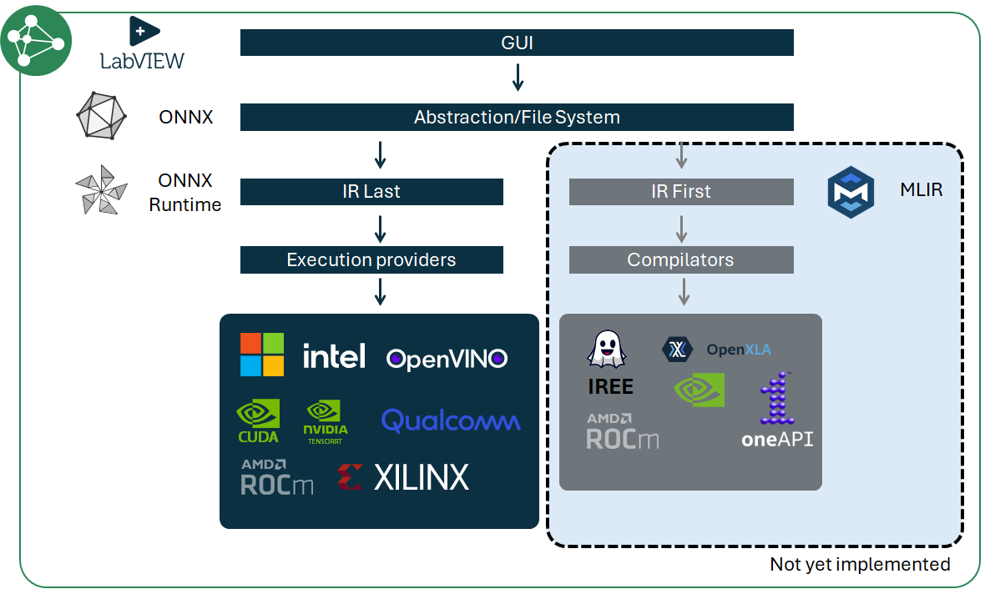
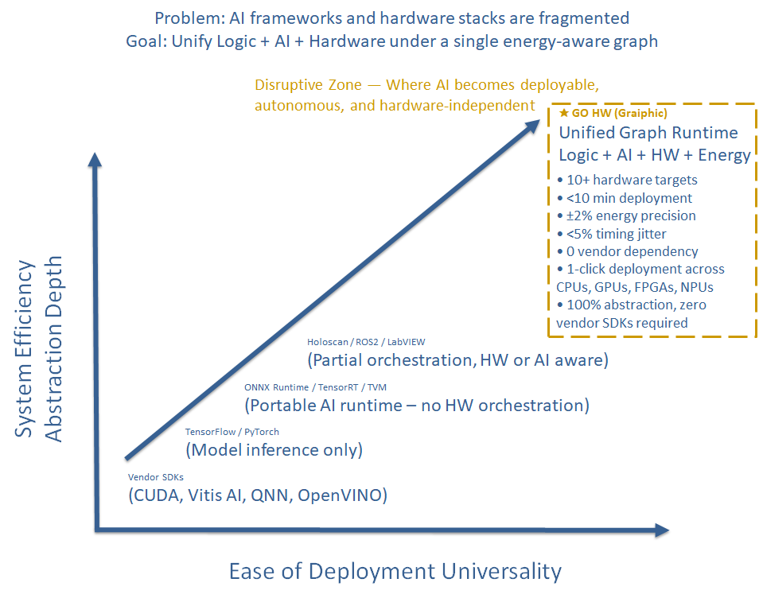
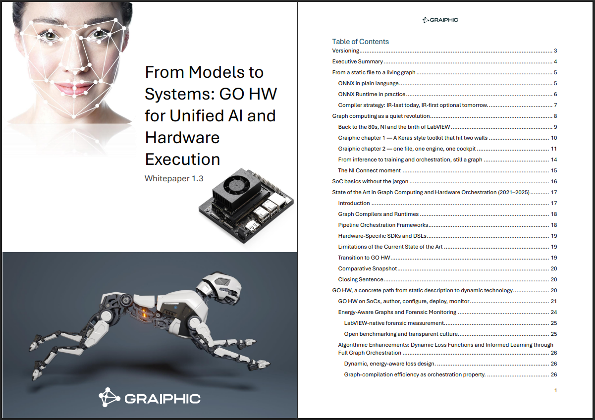

# Graiphic Whitepaper Series

Welcome to the **Graiphic Whitepaper Collection**, a public series of technical papers documenting our work on **graph computing**, **AI orchestration**, and **hardware integration**.

Graiphic develops the world’s first system unifying **AI + Logic + Hardware + Energy** under a **single ONNX-based graph** — fully editable, executable, and measurable through **LabVIEW** and our in-house toolkits.

---

## 🧭 Philosophy of the Series

At Graiphic, everything begins with the **graph**.

We use **ONNX** not only as a model format, but as the **universal file system** describing the logic, dataflow, and hardware orchestration of an entire application.  
Our LabVIEW-based IDE and toolkits act as the graphical editors and compilers for these ONNX graphs.

Execution follows two complementary paradigms:

1. **IR-last (current)** — **ONNX Runtime** with optimized **Execution Providers** (CUDA, TensorRT, OpenVINO, ROCm, Xilinx, Qualcomm...).  
2. **IR-first (next)** — **MLIR** compilers (IREE, OpenXLA, oneAPI...) for ahead-of-time specialization and deterministic deployment.

This dual IR strategy keeps ONNX as the single source of truth while giving us runtime breadth today and compiler-grade control tomorrow.

---

### 🧩 Graph Execution Philosophy

  

- **ONNX = File system & abstraction layer**  
- **LabVIEW = Visual IDE & orchestration cockpit**  
- **Graiphic Toolkits = ONNX authoring + editing + execution bridges**  
- **IR-first / IR-last = compilation vs runtime orchestration**

---

### 🚀 Positioning in the AI Stack

  

Graiphic operates in the **disruptive zone** — where AI becomes deployable, autonomous, and hardware-independent.

---

## 📚 Whitepapers

### **1. GO HW — From Models to Systems (v1.3)**
**Theme:** Unified hardware orchestration in ONNX  
**Summary:** GO HW extends ONNX beyond inference to real-time control of physical systems. It introduces GPIO, DMA, ADC/DAC, timers, and energy-aware monitoring as ONNX nodes, enabling deterministic, low-latency execution on SoCs.

  

**File:** [`GO-HW_Whitepaper_1.3.pdf`](./GO-HW_Whitepaper_1.3.pdf)

---

### **2. Toolkit Performance & Compiler Benchmark (v1.0 – upcoming)**
Benchmark comparing **Graiphic toolkits** (Accelerator & CUDA) vs **Ngene CuLab**, **G²CPU**, and **native LabVIEW**:  
performance (CPU/GPU), compiler behavior, memory efficiency, ergonomics, coverage, limitations.

---

### **3. GO GenAI — From Language to Logic Graphs (v1.0 – upcoming)**
Dynamic ONNX graphs for reasoning and agents, bridging GO HW with cognitive orchestration on sovereign hardware.

---

### **4. SOTA — The LabVIEW IDE for Graph Computing (v1.0 – upcoming)**
LabVIEW-native ONNX IDE for unified authoring, compilation, and orchestration.

---

### **5. Green AI — Energy-Aware Graphs (v1.0 – upcoming)**
Energy as a first-class metric: telemetry, ONNX annotations, multi-objective optimization (accuracy + joules).

---

## 🧩 Purpose

The **Graiphic Whitepaper Series** aims to:
- Document the architectural and technological foundations of our stack (SOTA, GO GenAI, GO HW).  
- Provide transparent benchmarks and reproducible data for the LabVIEW and ONNX communities.  
- Bridge AI compilation research and industrial system design.  
- Serve as a reference for collaborations with **NI**, **STMicroelectronics**, **Horizon Europe**, **DARPA**, and **all partners willing to work with us**.

---

## 🔗 Learn More & Follow Us

**Learn more and download SOTA:**  
👉 [https://www.graiphic.io](https://www.graiphic.io)

**Follow us on YouTube:**  
👉 [https://www.youtube.com/@graiphic](https://www.youtube.com/@graiphic)

**News & Insights:**  
👉 [https://graiphic.io/news-insights/](https://graiphic.io/news-insights/)

---

## ✉️ Contact

📧 **hello@graiphic.io**

---

## 🪪 License
All documents and images are released under **CC BY-NC-SA 4.0**.  
© 2025 Graiphic — [graiphic.io](https://www.graiphic.io)
